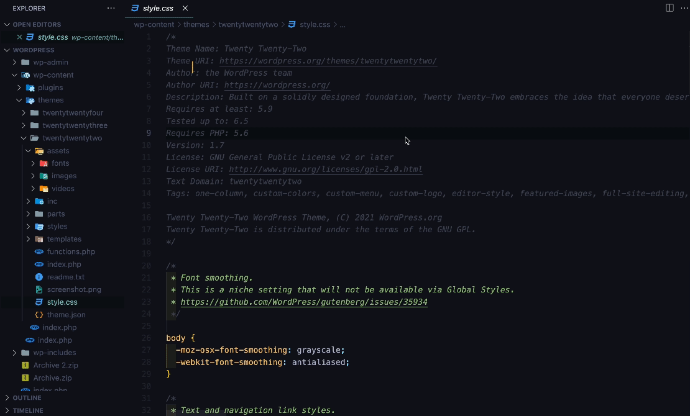
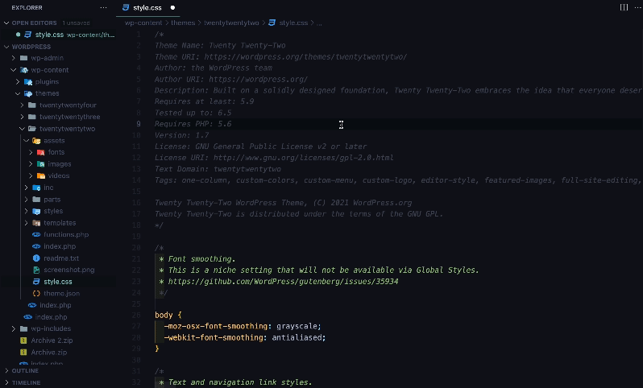

# CSS & JS Minifier Extension for VS Code


[](https://github.com/miguelcolmenares/css-js-minifier/actions?query=workflow%3ACodeQL "Code quality workflow status")

## Description

The CSS & JS Minifier extension for Visual Studio Code allows you to minify CSS and JavaScript files directly from the editor. Using the minification service provided by [Toptal](https://www.toptal.com/developers/), this extension makes it quick and easy to optimize your files.

## VS Code Compatibility Testing

[](https://github.com/miguelcolmenares/css-js-minifier/actions/workflows/test-vscode-minimum.yml "Minimum supported VS Code version - tested on all platforms")
[](https://github.com/miguelcolmenares/css-js-minifier/actions/workflows/test-vscode-stable.yml "Current stable VS Code version - tested on all platforms")
[](https://github.com/miguelcolmenares/css-js-minifier/actions/workflows/test-vscode-insiders.yml "Pre-release VS Code version - tested on Ubuntu only")

This extension is thoroughly tested across multiple VS Code versions to ensure compatibility:

- **1.90.0 (Minimum)**: Engine requirement baseline - tested on macOS, Ubuntu, and Windows
- **Stable**: Current production release - tested on all platforms  
- **Insiders**: Pre-release builds - tested on Ubuntu for early compatibility validation

## Demo
Minify File through context menu



Minify and Save as New File through context menu




## Key Features

-   **CSS and JavaScript Minification**: Minify open CSS and JS files in the editor using commands from the command palette or the context menu.
-   **Minify to New File**: Save the minified file to a new file with the `.min` suffix (e.g., `file.min.css` or `file.min.js`).
-   **Automatic Minification on Save**: Configure the extension to automatically minify CSS and JS files when saving them.
-   **Intuitive Commands**: Easily access minification features through the command palette and the editor's context menu.

## Available Commands

-   `Minify`: Minifies the current CSS or JS file and overwrites its content.
-   `Minify and Save as New File`: Minifies the current CSS or JS file and saves the result to a new file with the `.min` suffix.

## Configuration

You can customize the extension's behavior through the available settings in VS Code:

-   `css-js-minifier.minifyOnSave`: Automatically minify CSS and JS files when saving them. (`true` or `false`, default is `false`).
-   `css-js-minifier.minifyInNewFile`: Save the minified content to a new file instead of overwriting the original. (`true` or `false`, default is `false`).
-   `css-js-minifier.minifiedNewFilePrefix`: Specify a custom prefix for the new minified file. (default is `.min`).

To adjust these settings, add the following lines to your `settings.json` file:

```json
{
	"css-js-minifier.minifyOnSave": true,
	"css-js-minifier.minifyInNewFile": true,
	"css-js-minifier.minifiedNewFilePrefix": ".min"
}
```

## Keyboard Shortcuts

The extension provides convenient keyboard shortcuts for quick access to its commands:

-   `Minify`:
    -   `alt+ctrl+m` (Windows/Linux)
    -   `option+ctrl+m` (Mac)
-   `Minify and Save as New File`:
    -   `alt+ctrl+n` (Windows/Linux)
    -   `option+ctrl+n` (Mac)

## Installation

1. Open VS Code.
2. Go to the Extensions view by clicking the Extensions icon in the Activity Bar on the side of the window or by pressing `Ctrl+Shift+X` (Windows/Linux) or `Cmd+Shift+X` (Mac)
3. Search for "`CSS & JS Minifier`".
4. Click Install.

## Usage

1. Open a CSS or JS file in VS Code.
2. Use the command palette (`Ctrl+Shift+P` or `Cmd+Shift+P` on Mac) and type Minify to access the minification commands.
3. Alternatively, right-click within the editor and select the desired minification option from the context menu.

## Contributing

Contributions are welcome! Feel free to open issues or submit pull requests on the [GitHub repository](https://github.com/miguelcolmenares/css-js-minifier.git).

## License

This extension is licensed under the [MIT License](LICENSE.md).

## Changelog

All notable changes to the "css-js-minifier" extension will be documented in this file. [Change Log](CHANGELOG.md)# Trigger workflows
